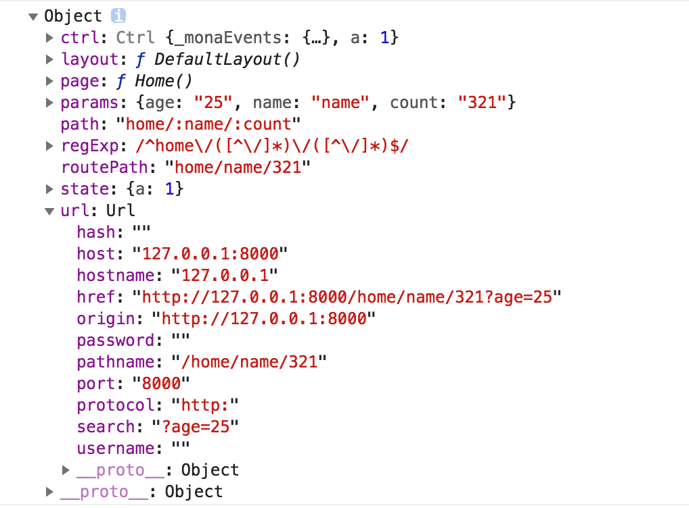

# 轻量赋能版 react-router

摒弃同类产品的劣根，汲取优秀产品的精华，结合数据管理的优势，打造出轻量实用幸福的产品，为react-router更好的赋能！！

[](https://www.npmjs.com/package/@monajs/react-router) [](https://www.npmjs.com/package/@monajs/react-router)

## 大致介绍

这款轻量版 react-router 是基于 history api 和 hash 实现的，用户可以根据业务场景和需求选择 router 类型。
> router 实现可以参考 [对前端路由选择的思考](https://github.com/func-star/blog/issues/22)

除此之外，mo-react-router 还融合了全局状态管理，用户可以将数据绑定在当前路径实例上，用户可以自由方便的通过路由来获取其他模块的数据。

### 依赖

- [@monajs/events](https://github.com/monajs/mona-events)

### 安装

```bash
$ npm i --save @monajs/react-router
```

- [上手使用](#上手使用)
- [如何实现页面间跳转](#如何实现页面间跳转)
- [如何获取页面的信息](#如何获取页面的信息)
- [如何监听路由变化](#如何监听路由变化)

### 上手使用

```js
import React, { Component } from 'react';
import { render } from 'react-dom';
import Router from '@monajs/react-router';

import DefaultLayout from 'views/layout/default'
import NoMatch from 'pages/noMatch'
import Home from 'pages/home'

const routerConf =  {
	index: 'home',
	emptyPage: 'test',
	type: 'history',
	routeList: [
		{
			layout: DefaultLayout,
			routes: {
				'home/:name/:count': Home
			}
		}, {
			routes: {
				'404': NoMatch
			}
		}
	]
}

render(<Router config={routerConf} />, document.getElementById('appWrapper'));

```

#### config 属性介绍

| 参数 | 说明 | 类型 | 默认值 |
| --- | --- | --- | :-- |
| index | 默认打开的路径 | String | null |
| emptyPage | 未识别到路径时打开的路径 |String | '404' |
| type | router 类型，提供 history 和 hash 两种选择 | String | 'hash' |
| routeList | 路由配置列表 | Array | null |

#### routeList 介绍
- `layout` 指的是页面采用的布局，可以为空
- `routes` 指的是页面的路径和页面实例的映射关系
- 当路由类型为 history 时，可以通过 `/:`的姿势配置 url 传参数形式

### 如何实现页面间跳转

```js
import Router from '@monajs/react-router'

const Link = Router.link

...

<Link activeClassName="active" className="a" to={{ path: 'home/name/321?age=25', state: { a: 1 } }}>test</Link>
// <Link activeClassName="active" className="a" to='home/name/321?age=25'>test</Link>
```
#### Link 组件 api

| 参数 | 说明 | 类型 | 默认值 |
| --- | --- | --- | :-- |
| to | 跳转的目标页面信息 | String|Object | null |
| activeClassName | 激活状态下的class | String | '' |
| className | 附加className | String | '' |

* 当路由类型为 history 时，可以通过设置 state 值来传递 history 的 state 属性

#### api 跳转

```js
import Router from '@monajs/react-router'

...

Router.go ('404', {name: 'yangxi'}, 'title', {s: 'state'})
```
#### Router.go 方法参数
`Router.go (path, data, title = '', state = {})`

| 参数 | 说明 | 类型 | 默认值 |
| --- | --- | --- | :-- |
| path | 跳转路径 | String | '' |
| data | 参数对象 | Object | {} |
| title | 当路由类型为 history 时传递的 title 值 | String | '' |
| state | 当路由类型为 history 时传递的 state 值 | Object | {} |


### 如何获取页面的信息
#### 获取本页面信息
```js
import Router from '@monajs/react-router'

...

console.dir(Router.current)
```
#### 获取其他面信息
```js
import Router from '@monajs/react-router'

...

console.dir(Router.routeInfo)
```



下面来介绍一下都包含哪些信息

| 参数 | 说明 | 类型 | 默认值 |
| --- | --- | --- | :-- |
| ctrl | 绑定在 页面实例上的全局控制器，其他页面都可以通过 | Object | null |
| layout | 当前页面采用的布局实例 | 类 | null |
| page | 当前页面实例 | 类 | null |
| params | 页面传递的参数 | Object | {} |
| path | route 配置中的路径配置，包含参数 | String | '' |
| state | 当路由类型为 history 时，页面传递的 state 参数 | Object | null |
| url | url 实例 | Object | null |

### 如何监听路由变化

```js
import Router from '@monajs/react-router'
...

Router.addEventListener('onChange', (res) => {
	console.log(res)
})
```

## 联系我
> 微信：yx12032331
